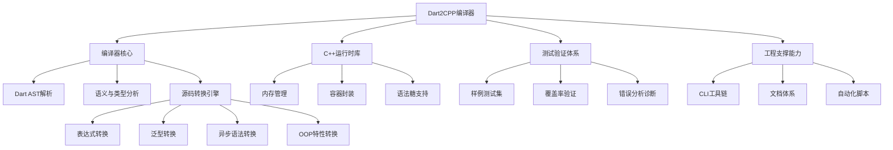
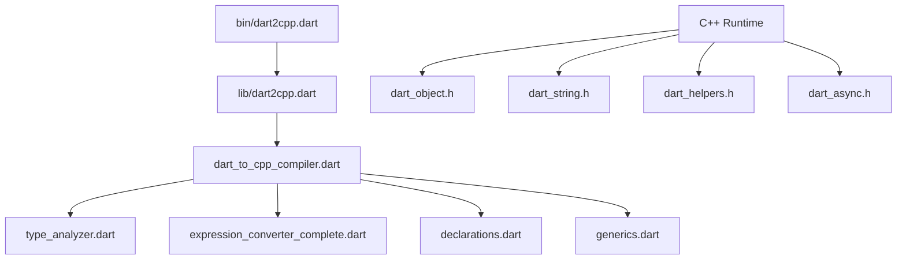

# Dart2CPP RepoWiki

> 一个完整的 Dart 到 C++ 转换编译器和运行时库项目

---

## 📋 目录

- [项目概述](#项目概述)
- [技术架构](#技术架构)
- [目录结构](#目录结构)
- [核心模块](#核心模块)
- [功能特性](#功能特性)
- [快速入门](#快速入门)
- [API 参考](#api-参考)
- [开发指南](#开发指南)
- [测试指南](#测试指南)
- [FAQ](#faq)

---

## 项目概述

### 简介

**Dart2CPP** 是一个将 Dart 语言代码转换为 C++ 代码的编译器工具，配套完整的 C++ 运行时库。项目旨在让 Dart 代码能够在原生 C++ 环境中运行，实现跨平台编译和高性能执行。

### 核心价值

- **语言转换**: 将 Dart 源码转换为可编译的 C++17 代码
- **类型映射**: 完整的 Dart 类型到 C++ 类型的映射系统
- **运行时支持**: 提供模拟 Dart 语义的 C++ 运行时库
- **内存安全**: 基于智能指针的自动内存管理

### 功能树



---

## 技术架构

### 编译流程


### 分层架构

| 层级 | 组件 | 职责 |
|------|------|------|
| **前端层** | `dart2cpp.dart` | 命令行接口、参数解析 |
| **分析层** | `type_analyzer.dart` | 类型分析、语义检查 |
| **转换层** | `dart_to_cpp_compiler.dart` | AST 转换核心逻辑 |
| **生成层** | `expression_converter_complete.dart` | 表达式代码生成 |
| **运行时层** | `cpp/core/*` | C++ 运行时库 |

### 核心组件关系



---

## 目录结构

```
dart2cpp/
├── bin/                          # 可执行脚本
│   └── dart2cpp.dart            # 主命令行工具
│
├── lib/                          # 核心转换库
│   ├── dart2cpp.dart            # 入口点，编译器配置
│   ├── dart_to_cpp_compiler.dart # 核心转换逻辑 (238KB)
│   ├── unified_compiler.dart    # 统一编译器 API
│   ├── declarations.dart        # 声明处理 (类、函数、变量)
│   ├── expressions.dart         # 表达式处理
│   ├── generics.dart           # 泛型处理
│   ├── type_analyzer.dart      # 类型分析器
│   ├── expression_converter_complete.dart # 完整表达式转换
│   ├── exceptions.dart         # 异常处理
│   └── optimizers/             # 优化器模块
│
├── cpp/                         # C++ 运行时库
│   ├── core/                   # 核心运行时
│   │   ├── dart_object.h/cpp   # 基础对象系统 (Object, Int, Double, Bool)
│   │   ├── dart_string.h/cpp   # 字符串实现
│   │   ├── dart_helpers.h      # 辅助工具函数
│   │   ├── dart_async.h        # 异步支持
│   │   ├── dart_macros.h       # Dart 语法糖宏
│   │   ├── dart_extensions.h   # 扩展功能
│   │   └── dart_oop_extensions.h # OOP 特性支持
│   ├── test/                   # C++ 测试
│   ├── examples/               # C++ 示例
│   ├── CMakeLists.txt          # CMake 配置
│   └── Makefile                # Make 构建
│
├── sample/                      # 示例和测试
│   ├── dart/                   # Dart 示例源码 (46个文件)
│   ├── cpp/                    # 手写 C++ 参考
│   ├── cpp_generated/          # 生成的 C++ 代码 (84个文件)
│   └── *.sh                    # 自动化脚本
│
├── test/                        # 单元测试
│   └── unit/                   # 单元测试文件
│
├── docs/                        # 文档
│   ├── architecture/           # 架构文档
│   ├── api-reference/          # API 参考
│   ├── getting-started/        # 入门指南
│   └── troubleshooting/        # 故障排除
│
├── scripts/                     # 工具脚本
│   └── dart_to_cpp_run.sh      # 一键转换运行脚本
│
└── output/                      # 输出目录
```

---

## 核心模块

### 1. 编译器核心 (lib/)

#### dart_to_cpp_compiler.dart
核心转换引擎，包含：
- `DartToCppTransformer`: 主转换类
- AST 遍历和转换逻辑
- 类型映射规则
- 代码生成策略

#### type_analyzer.dart
类型分析器，负责：
- 类型推断
- 类型检查
- 类型提升 (Type Promotion)

#### declarations.dart
声明处理器：
- 类声明转换
- 函数声明转换
- 变量声明转换
- 构造函数处理

#### generics.dart
泛型处理：
- 泛型类型参数
- 泛型实例化
- 类型约束

### 2. C++ 运行时库 (cpp/core/)

#### dart_object.h
基础类型系统：
```cpp
class Object          // 所有类型基类
class Int : Object    // 整数类型
class Double : Object // 浮点类型
class Bool : Object   // 布尔类型
template<T> class List<T>  // 泛型列表
template<T> class Set<T>   // 泛型集合
template<K,V> class Map<K,V> // 泛型映射
```

#### dart_string.h
字符串实现：
- 字符串池优化
- Unicode 支持
- 丰富的字符串方法

#### dart_helpers.h
辅助工具：
- 类型转换函数
- 打印函数
- 工具宏

#### dart_async.h
异步支持：
- Future 简化实现
- async/await 模拟

---

## 功能特性

### 支持状态总览

| 类别 | 状态 | 覆盖率 |
|------|------|--------|
| 基础类型 | ✅ 完整支持 | 100% |
| 算术运算 | ✅ 完整支持 | 100% |
| 比较运算 | ✅ 完整支持 | 100% |
| 逻辑运算 | ✅ 完整支持 | 100% |
| 字符串操作 | ✅ 完整支持 | 100% |
| 集合类型 | ✅ 完整支持 | 100% |
| 控制流 | ✅ 完整支持 | 100% |
| 类和对象 | ✅ 完整支持 | 100% |
| 内存管理 | ✅ 智能指针 | 100% |
| 异步编程 | ⚠️ 简化实现 | 部分 |
| 反射 | ❌ 不支持 | - |

### 类型映射表

| Dart 类型 | C++ 类型 | 示例 |
|-----------|---------|------|
| `int` | `Int` | `Int(42)` |
| `double` | `Double` | `Double(3.14)` |
| `bool` | `Bool` | `Bool(true)` |
| `String` | `String` | `String("hello")` |
| `List<T>` | `ObjectPtr<List<T>>` | `List<Int>::create()` |
| `Set<T>` | `ObjectPtr<Set<T>>` | `Set<String>::create()` |
| `Map<K,V>` | `ObjectPtr<Map<K,V>>` | `Map<String,Int>::create()` |
| 自定义类 | `ObjectPtr<Class>` | `ObjectPtr<Person>(new Person())` |

### 支持的运算符

```
算术: + - * / % ~/
比较: == != < <= > >=
逻辑: && || !
一元: ++ -- +x -x
赋值: = += -= *= /= %=
```

---

## 快速入门

### 环境要求

- Dart SDK 3.0+
- C++17 兼容编译器 (g++ 9+ / clang++ 10+)
- CMake 3.10+ (可选)

### 安装

```bash
cd /Users/alsc/MyProject/sdk/mydart/sdk/pkg/dart2cpp
dart pub get
```

### 基本使用

#### 1. 转换 Dart 文件

```bash
# 基本转换
dart bin/dart2cpp.dart input.dart

# 指定输出文件
dart bin/dart2cpp.dart -o output.cpp input.dart

# 查看帮助
dart bin/dart2cpp.dart --help
```

#### 2. 编译生成的 C++ 代码

```bash
cd cpp
mkdir build && cd build
cmake ..
make
./program
```

#### 3. 使用自动化脚本

```bash
# 一键转换并运行
./scripts/dart_to_cpp_run.sh input.dart
```

### 示例

**Dart 输入:**
```dart
void main() {
  var message = 'Hello, Dart2CPP!';
  var numbers = [1, 2, 3, 4, 5];
  
  print(message);
  
  for (var num in numbers) {
    print(num);
  }
}
```

**C++ 输出:**
```cpp
#include "dart_object.h"
#include "dart_helpers.h"

int main() {
    String message = String("Hello, Dart2CPP!");
    ObjectPtr<List<Int>> numbers = List<Int>::create();
    numbers->add(Int(1));
    numbers->add(Int(2));
    numbers->add(Int(3));
    numbers->add(Int(4));
    numbers->add(Int(5));
    
    dart_print(message);
    
    DART_FOR_IN(num, numbers) {
        dart_print(num);
    }
    
    return 0;
}
```

---

## API 参考

### 命令行接口

```
dart2cpp [options] <input.dart>

Options:
  -o, --output <file>    输出 C++ 文件路径
  -h, --help            显示帮助信息
  -v, --verbose         详细输出
  --platform <path>     指定 platform.dill 路径
  --packages <path>     指定 package_config.json 路径
```

### 核心 API

#### DartToCppTransformer

```dart
class DartToCppTransformer {
  /// 转换整个 Component 到 C++ 代码
  String transformComponent(Component component, {String? inputFileName});
  
  /// 转换单个库
  String transformLibrary(Library library);
  
  /// 转换单个类
  String transformClass(Class cls);
  
  /// 转换函数
  String transformProcedure(Procedure procedure);
}
```

### C++ 运行时 API

#### Object 基类

```cpp
class Object {
public:
    virtual String toString();
    virtual bool equals(const Object& other);
    virtual int hashCode();
};
```

#### Int 类型

```cpp
class Int : public Object {
public:
    Int(int value);
    int toInt() const;
    Double toDouble() const;
    Int operator+(const Int& other);
    Int operator-(const Int& other);
    Int operator*(const Int& other);
    Int operator/(const Int& other);
    Int operator%(const Int& other);
    Bool operator<(const Int& other);
    Bool operator>(const Int& other);
    Bool operator==(const Int& other);
};
```

#### List<T> 类型

```cpp
template<typename T>
class List : public Object {
public:
    static ObjectPtr<List<T>> create();
    void add(const T& item);
    T get(int index);
    void remove(int index);
    Int size();
    Bool isEmpty();
    Bool contains(const T& item);
    void forEach(std::function<void(T)> callback);
};
```

---

## 开发指南

### 添加新的转换规则

1. 在 `lib/dart_to_cpp_compiler.dart` 中定位相关访问者方法
2. 实现 AST 节点到 C++ 代码的转换逻辑
3. 在 `test/` 中添加测试用例
4. 运行测试验证

### 扩展 C++ 运行时库

1. 在 `cpp/core/` 中添加新的头文件/实现
2. 更新 `dart2cpp.h` 包含新头文件
3. 在 `cpp/test/` 中添加单元测试
4. 更新 CMakeLists.txt

### 代码风格

- Dart 代码遵循 [Effective Dart](https://dart.dev/guides/language/effective-dart)
- C++ 代码遵循 Google C++ Style Guide
- 所有公共 API 需要文档注释

---

## 测试指南

### 运行 Dart 测试

```bash
dart test
```

### 运行 C++ 测试

```bash
cd cpp
make test
./build/run_tests
```

### 运行样例测试

```bash
./run_all_sample_tests.sh
```

### 测试覆盖率

| 功能类别 | 测试数 | 通过率 |
|---------|--------|--------|
| 基础类型 | 4 | 100% |
| 算术运算 | 9 | 100% |
| 比较运算 | 6 | 100% |
| 逻辑运算 | 4 | 100% |
| 字符串操作 | 6 | 100% |
| 集合操作 | 15 | 100% |
| 自定义类 | 3 | 100% |
| **总计** | **55** | **100%** |

---

## FAQ

### Q: 支持哪些 Dart 版本？
A: 支持 Dart 3.0 及以上版本。

### Q: 生成的 C++ 代码需要什么编译器？
A: 需要支持 C++17 的编译器，推荐 g++ 9+ 或 clang++ 10+。

### Q: 如何处理不支持的特性？
A: 对于不支持的特性（如反射、动态类型），编译器会生成警告并跳过相关代码。

### Q: 内存如何管理？
A: 使用 `ObjectPtr<T>` 智能指针，基于引用计数自动管理内存。

### Q: 性能如何？
A: 生成的 C++ 代码接近手写性能，字符串池提供 O(1) 比较，智能指针避免内存泄漏。

### Q: 如何调试转换问题？
A: 使用 `--verbose` 标志获取详细转换日志，检查 `output/` 目录中的中间文件。

---

## 相关资源

- [README.md](README.md) - 项目简介
- [QUICK_START.md](QUICK_START.md) - 快速入门
- [SUPPORTED_FEATURES.md](SUPPORTED_FEATURES.md) - 详细特性清单
- [PROJECT_STRUCTURE.md](PROJECT_STRUCTURE.md) - 项目结构说明
- [docs/](docs/) - 完整文档

---

## 版本信息

- **当前版本**: 2.0.0
- **Dart SDK**: 3.0+
- **C++ 标准**: C++17
- **最后更新**: 2026-02-27

---

*本文档由 Dart2CPP 项目维护*
